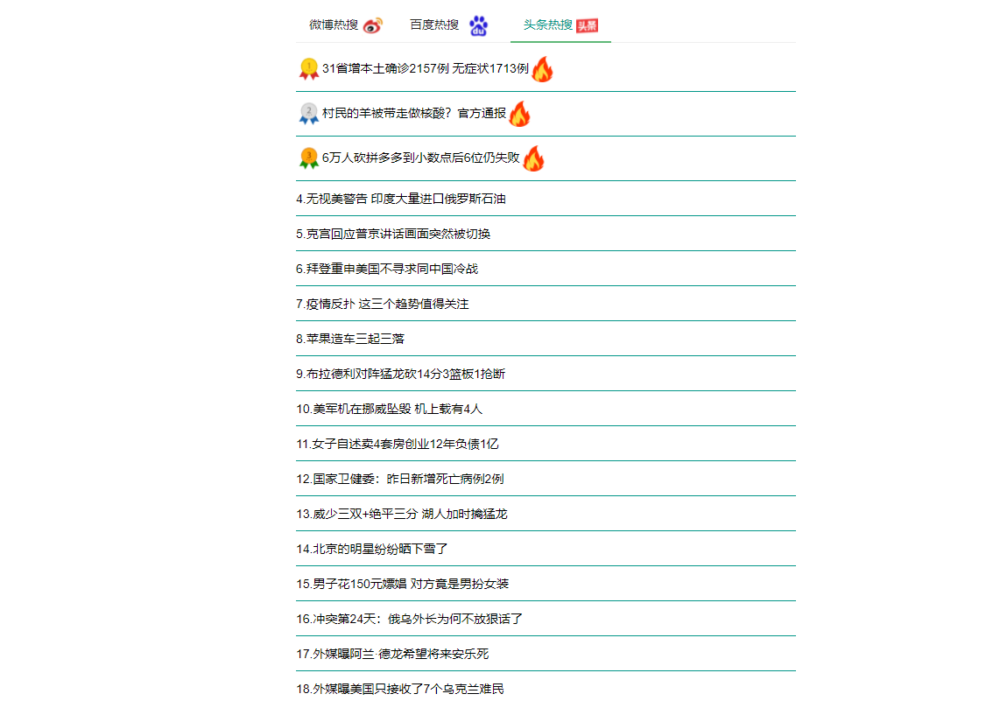

# Hot search navigation page (automatically aggregates hot search data of three major websites).

# feature list.
- crawlers pull Sina hot search, headline hot search, Baidu hot search, and store them in the database.
- A list of three hot searches is displayed on the page. Click to jump to the corresponding website to view details.

# using Technology.
- SpringBoot.
- simple JS, HTML, CSS.
- jdk version:11.
- the front-end pages under the static directory can be deployed separately

# example
